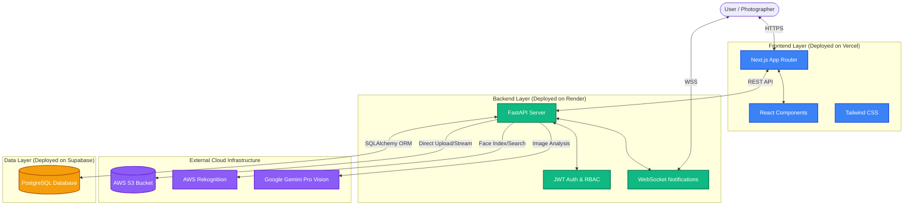

# System Architecture

The Capture Hub platform follows a modern, decoupled client-server architecture designed for high scalability and performance, even within constrained environments. 

## High-Level Architecture Diagram

## Deployment & Scalability Architecture

1. **Frontend (Vercel)**: 
   - A highly responsive SPA built with Next.js deployed on Vercel's Edge Network for global low-latency delivery.
2. **Backend (Render)**:
   - A high-performance Python ASGI application using FastAPI hosted on Render.
   - **Scalability Feature**: Dispatches heavy ML tasks (like AI tagging and facial indexing) to asynchronous background workers. This strictly prevents the 512MB RAM container from crashing with OOM errors during concurrent heavy loads.
3. **Database (Supabase)**:
   - Fully managed PostgreSQL database hosted on Supabase, interacting with the backend via SQLAlchemy ORM.
4. **Cloud Storage (AWS S3)**:
   - Media is not streamed directly through the constrained Render server. Instead, FastAPI generates AWS S3 pre-signed URLs, allowing clients to stream high-res images directly from Amazon's infrastructure.
5. **AI Inference Offloading**:
   - **Facial Recognition**: AWS Rekognition performs massive facial feature matrices comparisons in the cloud, bypassing local memory limits.
   - **Semantic Tagging**: Google Gemini Pro Vision handles complex image understanding and natural language generation for search tags.
