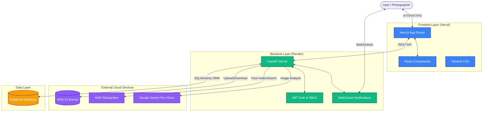

# System Architecture

The Capture Hub platform follows a modern, decoupled client-server architecture. The frontend is built with Next.js and React, while the backend is powered by FastAPI (Python). It leverages AWS for scalable cloud storage and facial recognition, alongside Google Gemini for generative AI image tagging.

## High-Level Architecture Diagram

## Component Breakdown

1. **Frontend (Client)**: 
   - A highly responsive Single Page Application (SPA) built with Next.js.
   - Communicates with the backend exclusively via REST API and WebSockets.
2. **Backend (Server)**:
   - A high-performance Python ASGI application using FastAPI.
   - Implements Role-Based Access Control (RBAC) to differentiate between Viewers, Photographers, Admins, and Superusers.
   - Dispatches heavy tasks (like AI tagging and facial indexing) to asynchronous background workers to prevent request blocking.
3. **Cloud Infrastructure**:
   - **AWS S3**: Scalable object storage for all uploaded media. Files are served directly from S3 via pre-signed URLs to reduce server load.
   - **AWS Rekognition**: Used to index uploaded faces and perform facial search ("Find Myself" feature) without consuming server RAM.
   - **Google Gemini**: Used to analyze image contents and automatically generate descriptive metadata tags for semantic search.
