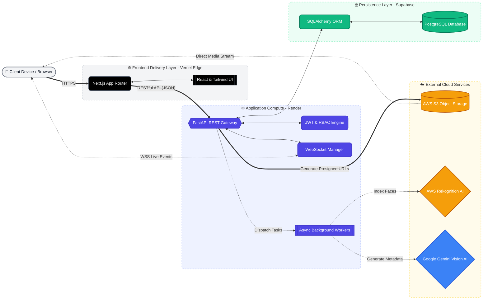

# System Architecture

The Capture Hub platform follows a modern, decoupled client-server architecture designed for high scalability and performance, even within constrained environments. 

## High-Level Architecture Diagram

## Architecting for Massive Scalability

When designing this platform, I had to overcome the strict 512MB RAM limitation of free-tier and low-tier compute instances (like Render). I achieved this through several specific architectural choices:

1. **Edge Network Delivery**: By deploying the Next.js SPA to Vercel's Edge Network, static assets and HTML are cached globally close to the user, drastically reducing Time-To-First-Byte (TTFB) and shifting bandwidth burden away from the backend.
2. **Asynchronous Background Processing**: Instead of blocking the main thread during heavy operations (like hitting external AI APIs or uploading large files to S3), the FastAPI backend immediately dispatches these tasks to non-blocking `BackgroundTasks`. This prevents memory spikes and OOM (Out Of Memory) crashes during concurrent uploads.
3. **Pre-signed URLs for Media Streaming**: To prevent the backend server from being choked by massive image bandwidth, the server never actually streams media files. Instead, it generates temporary AWS S3 Pre-signed URLs. The client's browser then fetches the uncompressed images directly from Amazon's localized infrastructure, completely decoupling compute from storage bandwidth.
4. **Cloud AI Inference Offloading**: Processing facial recognition models locally is impossible on 512MB of RAM. I innovated by utilizing AWS Rekognition to perform massive facial feature matrices comparisons entirely in the cloud, completely bypassing local compute limits.

## Architecting for Security & Data Privacy

Security was integrated deeply into the ORM and routing layers to prevent data leaks and unauthorized access:

1. **Stateless JWT Authentication**: Every API request is authenticated via securely signed JSON Web Tokens, mitigating CSRF attacks and eliminating the need for stateful server memory.
2. **Strict Foreign Key Constraints**: The SQLAlchemy ORM forces relational integrity at the database level. Deleting an event safely cascades down to delete roles, media, and comments, preventing orphaned data leaks.
3. **Dynamic Watermarking Engine**: To protect intellectual property, standard users cannot download raw assets. The backend intercepts download requests and dynamically burns a semi-transparent watermark (containing the Event Name and Photographer's Username) directly into the image bytes before serving it.
