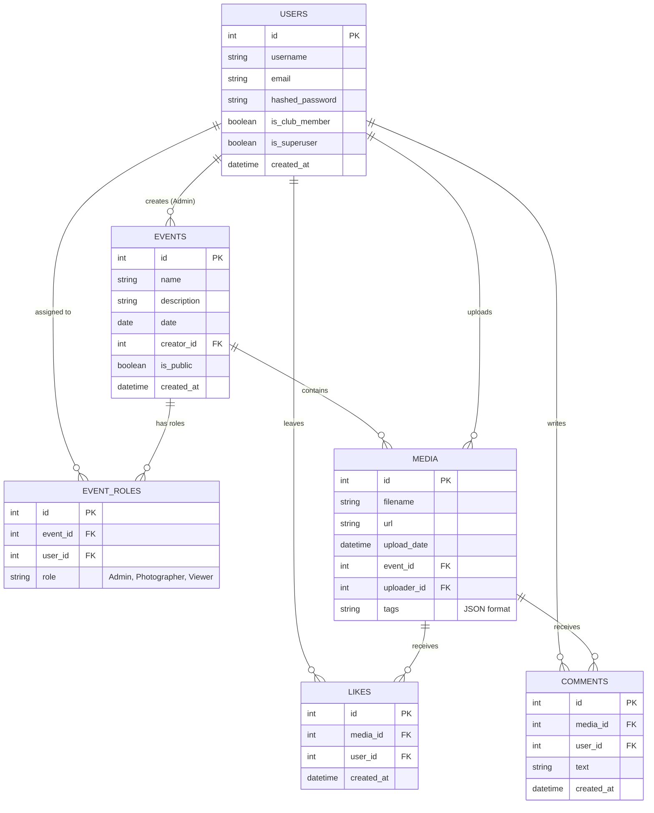

# Database Schema

The database for this platform is a relational SQL database. We use SQLAlchemy as our Object-Relational Mapper (ORM) to interact with the database.

Below is the Entity-Relationship (ER) Diagram representing the core data models.

## Entity-Relationship Diagram

## Core Models Description

- **Users**: Represents the individuals on the platform. Differentiates between normal users, official club members, and superusers (developers).
- **Events**: Represents a distinct photography event (e.g., a wedding, a hackathon). Can be public (visible to everyone) or private (visible only to assigned users).
- **Event Roles**: Manages the Role-Based Access Control (RBAC). Maps a `User` to an `Event` with a specific role (`Admin`, `Photographer`, `Viewer`).
- **Media**: Represents a single photo uploaded to an event. Contains the S3 URL and the AI-generated tags.
- **Likes & Comments**: Handles the social engagement features of the platform, linking a specific `User` to a specific `Media` item.
